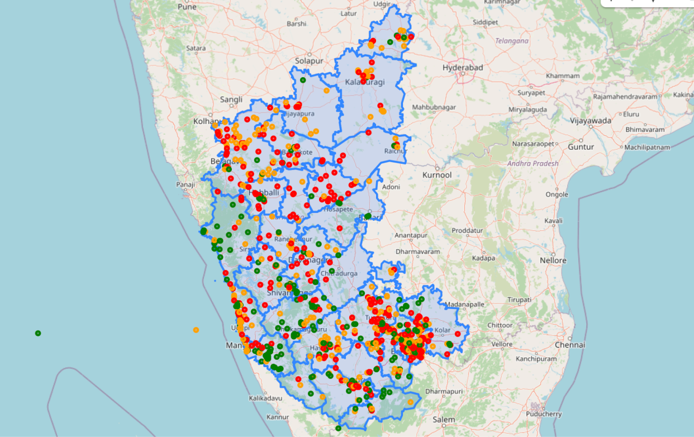
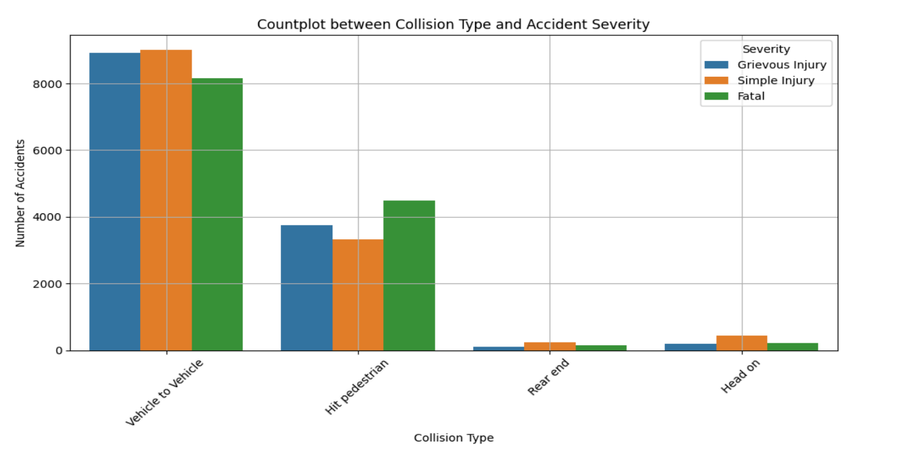
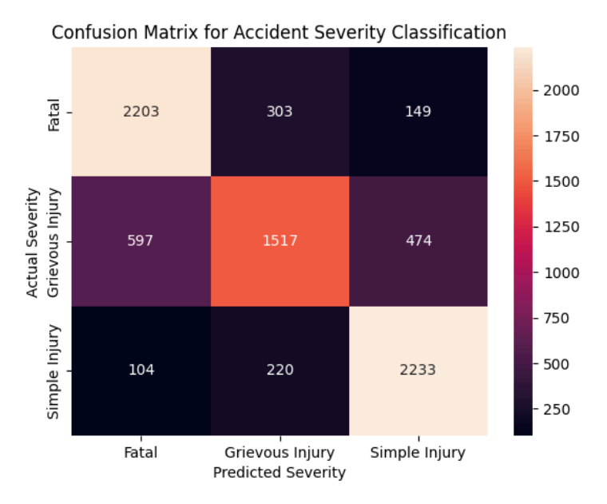

<h1 align="center">Karnataka Road Accident Severity Analysis</h1>

<p align="center">
  A geospatial machine learning project to predict and visualize the severity of road accidents in Karnataka, India from 2016-2023.
</p>

<p align="center">
  <a href="https://github.com/bhavitha-jayaprakash/Geospatial-Machine-Learning-Model-for-Karnataka-Road-Accident-Severity-2016-2023/stargazers">
    
  </a>
  <a href="https://github.com/bhavitha-jayaprakash/Geospatial-Machine-Learning-Model-for-Karnataka-Road-Accident-Severity-2016-2023/network/members">
    
  </a>
  <a href="https://github.com/bhavitha-jayaprakash/Geospatial-Machine-Learning-Model-for-Karnataka-Road-Accident-Severity-2016-2023/issues">
    
  </a>
  <a href="https://github.com/bhavitha-jayaprakash/Geospatial-Machine-Learning-Model-for-Karnataka-Road-Accident-Severity-2016-2023/blob/main/LICENSE">
    
  </a>
</p>
<br>

<details>
  <summary><b>Table of Contents</b></summary>
  <ol>
    <li><a href="#-about-the-project">About The Project</a></li>
    <li><a href="#-built-with">Built With</a></li>
    <li><a href="#-getting-started">Getting Started</a></li>
    <li><a href="#-key-visualizations--findings">Key Visualizations & Findings</a></li>
    <li><a href="#-roadmap">Roadmap</a></li>
    <li><a href="#-contributing">Contributing</a></li>
    <li><a href="#-license">License</a></li>
    <li><a href="#-acknowledgments">Acknowledgments</a></li>
  </ol>
</details>

<br>

## About The Project

Karnataka faces a persistent challenge with road accidents, leading to significant loss of life and severe injuries. This project addresses the critical need for data-driven safety measures by analyzing historical accident data from 2016 to 2023.

The core of this project is a **Random Forest Classifier** that predicts accident severity into three classes: `Fatal`, `Grievous Injury`, and `Simple Injury`. By leveraging geospatial data, the analysis goes beyond prediction to pinpoint high-risk zones and accident hotspots, offering actionable insights for policymakers and law enforcement to improve road safety infrastructure and strategies.

<br>

## Built With

This analysis was conducted using the following core libraries and tools:

| Category                      | Tools & Libraries                                                                                                                                                                                                                                     |
| :---------------------------- | :---------------------------------------------------------------------------------------------------------------------------------------------------------------------------------------------------------------------------------------------------- |
| **Data Manipulation & Analysis** |                                                                                                                                                     |
| **Machine Learning** |                                                                                                                                   |
| **Data Visualization** |                           |
| **Geospatial Analysis** |  **Folium** |
| **Environment** |   |

<br>

## Getting Started

To get a local copy up and running, follow these simple steps.

### Prerequisites

You need Python installed on your system along with the `pip` package manager.

### Installation & Execution

1.  **Clone the repository:**
    ```sh
    git clone https://github.com/bhavitha-jayaprakash/Geospatial-Machine-Learning-Model-for-Karnataka-Road-Accident-Severity-2016-2023.git
    cd Geospatial-Machine-Learning-Model-for-Karnataka-Road-Accident-Severity-2016-2023
    ```
2.  **Install the required packages:**
    ```sh
    pip install pandas scikit-learn matplotlib seaborn geopandas folium jupyterlab
    ```
3.  **Place your data:**
    Ensure the dataset `Copy of AccidentReports.csv` and the GeoJSON file `karnataka.geojson` are in the project's root directory or update the file paths in the notebook.

4.  **Run the Jupyter Notebook:**
    ```sh
    jupyter lab Karnataka_RoadAccidents.ipynb
    ```
    Execute the cells sequentially to see the complete analysis, from data cleaning to model evaluation and visualization.

<br>

## Key Visualizations & Findings

The project generated several key visualizations that tell a story about road accidents in Karnataka.

### Geospatial Hotspot Map

A `Folium` map was created to plot accidents across the state, with markers colored by severity. The map clearly shows that accidents, especially fatal ones, are heavily concentrated in and around major urban centers like **Bengaluru, Mysuru, and Davanagere** and along major state and national highways.



### Collision Type vs. Severity

This analysis revealed that while vehicle-to-vehicle collisions are the most common, **hit-pedestrian** incidents have a disproportionately high rate of fatal outcomes. This insight suggests a need for improved pedestrian safety infrastructure.



### Model Performance

The Random Forest model achieved a solid **accuracy of 76.32%**. The confusion matrix shows it is highly effective at identifying 'Fatal' and 'Simple Injury' cases but sometimes struggles to differentiate 'Grievous Injury' from the other two classes.



<br>

## Roadmap

While this project provides a strong foundation, there are several avenues for future development:
- [ ] **Develop an Interactive Dashboard:** Create a web-based dashboard using Streamlit or Dash to allow users to explore the data and predictions interactively.
- [ ] **Incorporate More Features:** Integrate additional data sources like road type, traffic density, and time of day to improve model accuracy.
- [ ] **Experiment with Advanced Models:** Implement deep learning models (e.g., LSTMs or Graph Neural Networks) to capture more complex spatio-temporal patterns.
- [ ] **Real-Time Analysis:** Build a pipeline to process and analyze accident data in near real-time.

See the [open issues](https://github.com/bhavitha-jayaprakash/Geospatial-Machine-Learning-Model-for-Karnataka-Road-Accident-Severity-2016-2023/issues) for a full list of proposed features (and known issues).

<br>

## Contributing

Contributions are what make the open-source community such an amazing place to learn, inspire, and create. Any contributions you make are **greatly appreciated**.

If you have a suggestion that would make this better, please fork the repo and create a pull request. You can also simply open an issue with the tag "enhancement".

1.  Fork the Project
2.  Create your Feature Branch (`git checkout -b feature/AmazingFeature`)
3.  Commit your Changes (`git commit -m 'Add some AmazingFeature'`)
4.  Push to the Branch (`git push origin feature/AmazingFeature`)
5.  Open a Pull Request

<br>

## License

Distributed under the GPL-3.0 License. See `LICENSE` for more information.

<br>

## Acknowledgments

* This project was completed as part of the **Project Internship Program in Data Science with AIML**.
* Special thanks to the mentors and faculty at **Cranes Varsity Pvt. Ltd., Bangalore**, for their invaluable guidance and support.
